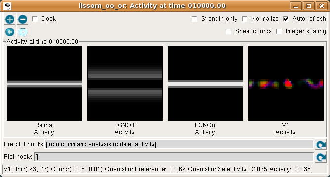

**********************
LISSOM Orientation Map
**********************

This tutorial shows how to use the `Topographica`_ software package
to explore a simple orientation map simulation using test patterns
and weight plots. This particular example uses a `LISSOM model`_
cortex, which has been used extensively in publications 
(e.g. `Miikkulainen et al., 2005 <http://computationalmaps.org>`_) 
but is no longer recommended for new work, because it has been 
superseded by the simpler but more robust 
`GCAL model <../Tutorials/gcal.html>`_. Although we focus on one model
in this tutorial, Topographica provides support for many other models
and allows a very large family of models to be constructed from 
the same components.

This tutorial assumes that you have already followed the
instructions for `obtaining and installing`_ Topographica. Also, you
will need to generate a saved orientation map network (a .typ file),
which can be done from a Unix or Mac terminal or Windows `command
prompt`_ by running

 ::

   topographica -a -c "generate_example('lissom_oo_or_10000.typ')"

Depending on the speed of your machine, you may want to go get a
snack at this point; on a 3GHz 512MB machine this training process
currently takes from 7-15 minutes (depending on the amount of level
2 cache). When training completes, lissom\_oo\_or\_10000.typ will be
saved in Topographica's `output path`_ ready for use in the
tutorial.

Response of an orientation map
------------------------------

In this example, we will load a saved network and test its behavior
by presenting different visual input patterns.

#. First, start the Topographica GUI from a terminal:

   ::
   
     topographica -g

   (Windows users can instead double click on the desktop
   Topographica icon.)
   This will open the Topographica console:

   .. figure:: images/topographica_console.png
      :align: center
      :alt: Console Window

   The window and button style will differ on different platforms,
   but similar buttons should be provided.

#. Next, load the saved network by selecting selecting Load snapshot
   from the Simulation menu and selecting
   ``lissom_oo_or_10000.typ``. This small orientation map simulation
   should load in a few seconds, with a 54x54 retina, a 36x36 LGN
   (composed of one 36x36 OFF channel sheet, and one 36x36 ON
   channel sheet), and a 48x48 V1 with about two million synaptic
   weights. The architecture can be viewed in the Model Editor
   window (which can be selected from the Simulation menu), but is
   also shown below:

   .. figure:: images/lissom_network_diagram_oo.png
      :align: center
      :alt: LISSOM network

   .. _activity-plot:

#. To see how this network responds to a simple visual image, first
   open an Activity window from the Plots menu on the Topographica
   Console, then select Test pattern from the Simulation menu to get
   the Test Pattern window:

   .. figure:: images/test_pattern_oo.png
      :align: center
      :alt: Test Pattern window

   Then select a Line Pattern generator, and hit Present to present
   a horizontal line to the network.

#. The Activity window should then show the result:

   .. figure:: images/activity_line_oo.png
      :align: center
      :alt: Response to a line

   This window shows the response for each neural area. For now,
   please turn on Strength only; it is usually off by default.

   As you move your mouse over the plots, information about the
   location of the mouse cursor is displayed in the status bar at
   the bottom of the window. For these plots, you can see the
   `matrix coordinates`_ (labeled "Unit"), `sheet coordinates`_
   (labeled "Coord"), and the activity level of the unit currently
   under the pointer.

   In the Retina plot, each photoreceptor is represented as a pixel
   whose shade of gray codes the response level, increasing from
   black to white. This pattern is what was specified in the Test
   Pattern window. Similarly, locations in the LGN that have an OFF
   or ON cell response to this pattern are shown in the LGNOff and
   LGNOn plots. At this stage the response level in V1 is also coded
   in shades of gray, and the numeric values can be found using the
   pointer.

   From these plots, you can see that the single line presented on
   the retina is edge-detected in the LGN, with ON LGN cells
   responding to areas brighter than their surround, and OFF LGN
   cells responding to areas darker than their surround. In V1, the
   response is patchy, as explained below.

   .. _connectionfields-plot:

#. To help understand the response patterns in V1, we can look at
   the weights to V1 neurons. These weights were learned previously,
   as a result of presenting 10000 pairs of oriented Gaussian
   patterns at random angles and positions. To plot a single neuron,
   select Connection Fields from the Plots menu. This will plot the
   synaptic strengths of connections to the neuron in the center of
   the cortex (by default):

   .. figure:: images/unit_weights_0_0_oo.png
      :align: center
      :alt: Weights of one neuron

   Again, for now please turn on Strength only; it is usually off by
   default.

   The plot shows the afferent weights to V1 (i.e., connections from
   the ON and OFF channels of the LGN), followed by the lateral
   excitatory and lateral inhibitory weights to that neuron from
   nearby neurons in V1. The afferent weights represent the retinal
   pattern that would most excite the neuron. For the particular
   neuron shown above, the optimal retinal stimulus would be a
   short, bright line oriented at about 0 degrees (from 9 o'clock to
   3 o'clock) in the center of the retina. (Note that the particular
   neuron you are viewing may have a different preferred
   orientation.)

   .. _projection-plot:

#. If all neurons had the same weight pattern, the response would
   not be patchy -- it would just be a blurred version of the input
   (for inputs matching the weight pattern), or blank (for other
   inputs). To see what the other neurons look like, select
   Projection from the Plots menu, then select LGNOnAfferent from
   the drop-down Projection list, followed by the refresh arrow next
   to 'Pre plot hooks':

   .. figure:: images/projection_oo.png
      :align: center
      :alt: Afferent weights of many neurons

   This plot shows the afferent weights from the LGN ON sheet for
   every fifth neuron in each direction. You can see that most of
   the neurons are selective for orientation (not just a circular
   spot), and each has a slightly different preferred orientation.
   This suggests an explanation for why the response is patchy:
   neurons preferring orientations other than the one present on the
   retina do not respond. You can also look at the LateralInhibitory
   weights instead of LGNOnAfferent; those are patchy as well
   because the typical activity patterns are patchy.

   .. _orientationpreference-plot:

#. To visualize all the neurons at once in experimental animals,
   optical imaging experiments measure responses to a variety of
   patterns and record the one most effective at stimulating each
   neuron. The results of a similar procedure can be viewed by
   selecting Plots > Preference Maps > Orientation Preference:

   .. figure:: images/oo_or_map.png
      :align: center
      :alt: Orientation map

   The Orientation Preference plot is the orientation map for V1 in
   this model. Each neuron in the plot is color coded by its
   preferred orientation, according to the key shown to the left of
   the plot. (If viewing a monochrome printout, see web page for the
   colors). Note that phase preference and selectivity are also
   displayed in the window, but these are not analyzed here (and are
   not shown above).

   You can see that nearby neurons have similar orientation
   preferences, as found in primate visual cortex. The Orientation
   Selectivity plot shows the relative selectivity of each neuron
   for orientation on an arbitrary scale; you can see that in this
   simulation nearly all neurons became orientation selective. The
   Orientation Preference&Selectivity plot shows the two other
   Orientation plots combined -- each neuron is colored with its
   preferred orientation, and the stronger the selectivity, the
   brighter the color. In this case, because the neurons are
   strongly selective, the Preference&Selectivity plot is nearly
   identical to the Preference plot.

   If you want to see what happens during map measurement, you can
   watch the procedure as it takes place by enabling visualization.
   Edit the 'Pre plot hooks' (as described in the `Changing existing
   plots section of the User Manual`_) so
   that the `measure\_sine\_pref`_ command's ``display`` parameter
   is turned on. Open an Activity window and ensure it has
   Auto-Refresh turned on, then press Refresh by the Orientation
   Preference window's 'Pre plot hooks'. You will see a series of
   sine gratings presented to the network, and can observe the
   response each time in the LGN and V1 sheets. When you are done,
   press Refresh on the pre-plot hooks in the Activity window to
   restore the original activity pattern plots.

#. Now that we have looked at the orientation map, we can see more
   clearly why activation patterns are patchy by coloring each
   neuron with its orientation preference. To do this, make sure
   that Strength only is now turned *off* in the Activity window:

   |Color-coded response to a line|
    |Orientation key|

   Each V1 neuron is now color coded by its orientation, with
   brighter colors indicating stronger activation. Additionally, the
   status bar beneath the plots now also shows the values of the
   separate channels comprising the plot: OrientationPreference
   (color), OrientationSelectivity (saturation), and Activity
   (brightness).

   The color coding allows us to see that the neurons responding are
   indeed those that prefer orientations similar to the input
   pattern, and that the response is patchy because other nearby
   neurons do not respond. To be sure of that, try selecting a line
   with a different orientation, and hit present again -- the colors
   should be different, and should match the orientation chosen.

#. If you now turn off Strength only in the Connection Fields
   window, you can see that the neuron whose weights we plotted is
   located in a patch of neurons with similar orientation
   preferences:

   |Colorized weights of one neuron|
    |image3|

   Look at the LateralExcitatory weights, which show that the
   neurons near the above neuron are nearly all red, to match its
   preferred orientation.

   Returning to the Test pattern window, try presenting a vertical
   line (orientation of ``pi/2``) and then, in the Activity window,
   right click on one of the cyan-colored patches of activity. This
   will bring up a menu:

   .. figure:: images/lissom_oo_or_activity_rightclick.png
      :align: center
      :alt: Right-click menu

   The menu offers operations on different parts of the plot: the
   first submenu shows operations available on the single selected
   unit, and the second shows operations available on the combined
   (visible) plot. The final three submenus show operations
   available on each of the separate channels that comprise the
   plot.

   Here we are interested to see the connection fields of the unit
   we selected, so we choose Connection Fields from the Single unit
   submenu to get a new plot:

   |image4|
    |image5|

   This time we can see from the LateralExcitatory weights that the
   neurons near this one are all colored cyan (i.e., are selective
   for vertical).

#. Right-click menus are available on most plots, and provide a
   convenient method of further investigating and understanding the
   plots. For instance, on the Orientation Preference window, the
   connection fields of units at any location can easily be
   visualized, allowing one to see the connection fields of units
   around different features of the map.

   As another example, an interesting property of orientation maps
   measured in animals is that their Fourier spectrums usually show
   a ring shape, because the orientations repeat at a constant
   spatial frequency in all directions. Selecting Hue channel:
   OrientationPreference > Fourier transform from the right-click
   menu allows us to see the same is true of the map generated by
   the LISSOM network:

   .. figure:: images/lissom_oo_or_orpref_ft.png
      :align: center
      :alt: FT of orientation preference map

#. Now that you have a feel for the various plots, you can try
   different input patterns, seeing how the cortex responds to each
   one. Just select a Pattern generator, e.g. Gaussian, Disk, or
   SineGrating, and then hit Present.

   For each Pattern generator, you can change various parameters
   that control its size, location, etc.:

       orientation
           controls the angle (try pi/4 or -pi/4)
       x and y
           control the position on the retina (try 0 or 0.5)
       size
           controls the overall size of e.g. Gaussians and rings
       aspect\_ratio
           controls the ratio between width and height; will be
           scaled by the size in both directions
       smoothing
           controls the amount of Gaussian falloff around the edges
           of patterns such as rings and lines
       scale
           controls the brightness (try 1.0 for a sine grating).
           Note that this relatively simple model is very sensitive
           to the scale, and scales higher than about 1.2 will
           result in a broad, orientation-unselective response,
           while low scales will give no response. More `complex
           models`_ (and actual brains!) are less sensitive to the
           scale or contrast.
       offset
           is added to every pixel
       frequency
           controls frequency of a sine grating or Gabor
       phase
           controls phase of a sine grating or Gabor
       mask\_shape
           allows the pattern to be masked by another pattern (e.g.
           try a mask\_shape of Disk or Ring with a SineGrating or
           UniformRandom pattern). The parameters of the mask\_shape
           pattern can be edited by right-clicking on it.

   To present photographs, select a Pattern generator of type
   FileImage. (You can type the path to an image file of your own
   (in e.g. PNG, JPG, TIFF, or PGM format) in the filename box.) For
   most photographs you will need to change the scale to something
   like 2.0 to see a reasonable response from this model V1, and you
   may want to enlarge the image size to look at details. A much
   larger, more complicated, and slower map would be required to see
   interesting patterns in the response to most images, but even
   with this network you may be able to see some
   orientation-specific responses to large contours in the image:

   |Ellen Arthur|

   Here we have enabled Sheet coords so that each plot will be at
   the correct size relative to each other. That way, the location
   of a given feature can be compared between images. In this
   particular network, the Retina and LGN stages each have an extra
   "buffer" region around the outside so that no V1 neuron will have
   its CF cut off, and the result is that V1 sees only the central
   region of the image in the LGN, and the LGN sees only the central
   region of the retina. (`Sheet coordinates`_ are normally turned
   off because they make the cortical plots smaller, but they can be
   very helpful for understanding how the sheets relate to each
   other.)

#. The procedure above allows you to explore the relationship
   between the input and the final response after the cortex has
   settled due to the lateral connections. If you want to understand
   the settling process itself, you can also visualize how the
   activity propagates from the retina to the LGN, from the LGN to
   V1, and then within V1. To do this, first make sure that there is
   an Activity window open, with Auto-refresh enabled. Then go to
   the console window and hit "Step" repeatedly. After an input is
   presented, you will see the activity arrive first in the LGN,
   then in V1, and then gradually change within V1. The Step button
   moves to the next scheduled event in the simulation, which are at
   even multiples of 0.05 for this particular simulation. You can
   also type in the specific duration (e.g. 0.05) to move forward
   into the "Run for:" box, and hit "Go" instead.

   As explained in the `User Manual`_, this process is controlled by
   the network structure and the delays between nodes. For
   simplicity, let's consider time starting at zero. The first
   scheduled event is that the Retina will be asked to draw an input
   pattern at time 0.05 (the phase of the `GeneratorSheet`_). Thus
   the first visible activity occurs in the Retina, at 0.05. The
   Retina is connected to the LGN with a delay of 0.05, and so the
   LGN responds at 0.10. The delay from the LGN to V1 is also 0.05,
   so V1 is first activated at time 0.15. V1 also has self
   connections with a delay of 0.05, and so V1 is then repeatedly
   activated every 0.05 timesteps. Eventually, the number of V1
   activations reaches a fixed limit for LISSOM (usually about 10
   timesteps), and no further events are generated or consumed until
   the next input is generated at time 1.05. Thus the default
   stepsize of 1.0 lets the user see the results after each input
   pattern has been presented and the cortex has come to a steady
   state, but results can also be examined at a finer timescale. Be
   sure to leave the time clock at an even multiple of 1.0 before
   you do anything else, so that the network will be in a
   well-defined state. (To do this, just type the fractional part
   into the "Run for:" box, i.e. 0.95 if the time is currently
   10002.05, press "Go", and then change "Run for:" to 1.0.)

Learning (optional)
-------------------

The previous examples all used a network trained previously, without
any plasticity enabled. Many researchers are interested in the
processes of development and plasticity. These processes can be
studied using the LISSOM model in Topographica as follows.

#. First, quit from any existing simulation, and `get a copy of the
   example files to work with`_ if you do not have them already.
   Then start a new run of Topographica:

   ::

     topographica -g

   From the Simulation menu, select Run Script. Then from the
   ``models`` directory, open ``lissom_oo_or.ty``.

#. Next, open an Activity window and make sure that it has
   Auto-refresh enabled. Unless your machine is very slow, also
   enable Auto-refresh in a Projection window showing LGNOnAfferent.
   On a very fast machine you could even Auto-refresh an Orientation
   Preference window (probably practical only if you reduce the
   nominal\_density of V1).

#. Now hit Go a few times on the Topographica Console window, each
   time looking at the random input(s) and the response to them in
   the Activity window. The effect on the network weights of
   learning this input can be seen in the Projection window.

#. With each new input, you may be able to see small changes in the
   weights of a few neurons in the LGNOnAfferent array (by peering
   closely). If the changes are too subtle for your taste, you can
   make each input have an obvious effect by speeding up learning to
   a highly implausible level. To do this, open the Model Editor
   window, right click on the LGNOnAfferent projection (the
   cone-shaped lines from LGNOn to V1), select Properties, and
   change Learning Rate from the default 0.48 to 100, press Apply,
   and then do the same for the LGNOffAfferent projection. Now each
   new pattern generated in a training iteration will nearly wipe
   out any existing weights.

#. For more control over the training inputs, open the Test Pattern
   window, select a Pattern generator, e.g. Disk, and other
   parameters as desired. Then enable Plastic in that window, and
   hit Present. You should again see how this input changes the
   weights, and can experiment with different inputs.
#. Once you have a particular input pattern designed, you can see
   how that pattern would affect the cortex over many iterations. To
   do so, open a Model Editor window and right click on the Retina's
   diagram, then select Properties from the resulting menu. In the
   Parameters of Retina window that opens, select the pattern type
   you want to use for the Input Generator item, and then right
   click on that pattern, choose Properties and, in the new window,
   modify any of its parameters as you wish. Note that you will
   probably want to have dynamic values for certain parameters. For
   instance, to have a random orientation for each presentation,
   right click on Orientation and select Enter dynamic value. The
   slider will disappear from the entry box, and you can type in an
   expression such as
   ``numbergen.UniformRandom(lbound=-pi,ubound=pi)``. When you have
   finished configuring your pattern, press Apply or Close on the
   Parameters of Gaussian window. Having now set up the input
   generator on the Parameters of Retina window, click Apply or
   Close on this too. Now when you press Go on the console window
   (assuming Run for is set to 1), you should see your pattern being
   presented in the Activity Window.

#. After a few steps (or to do e.g. 20 steps in a row, change Run
   for to 20 and press return) you can plot (or refresh) an
   Orientation Preference map to see what sort of orientation map
   has developed. (Press the 'Refresh' button next to the Pre plot
   hooks if no plot is visible when first opening the window.
   Measuring a new map will usually take about 15 seconds to
   complete.) If you've changed the learning rate to a high value,
   or haven't presented many inputs, the map will not resemble
   actual animal maps, but it should still have patches selective
   for each orientation.

#. If you are patient, you can even run a full, more realistic,
   simulation with your favorite type of input. To do this, quit and
   start again, then change the Retina's Input generator as before
   via the Model Editor, but make sure not to change the learning
   rate this time. Then you can change Run for to 10000 and press Go
   to see how a full simulation would work with your new inputs.
   Running for 10000 iterations will likely take at least several
   minutes for recent machines; if you are less patient, try doing
   1000 iterations at a time instead before looking at an
   Orientation Preference map.

#. If you are *really* patient, you can change the number of units
   to something closer to real primate cortex, by quitting and then
   restarting with a higher density in V1. To do this, you will need
   to specify the example script from the commandline. The path of
   the lissom\_oo\_or.ty script was printed by Topographica in step
   1 of this Learning section, but if you are not sure where the
   examples are located, you can find out by first running

   ::
   
     topographica -c "from topo.misc.genexamples import print_examples_dir; print_examples_dir()"

   Then you can use the path to the example, as well as specifying a
   higher cortex density, e.g.

   ::
   
     topographica -p cortex_density=142 ~/Documents/Topographica/examples/lissom_oo_or.ty -g

   You'll need about a gigabyte of memory and a lot of time, but you
   can then step through the simulation as above. The final result
   after 10000 iterations (requiring several hours on a 3GHz
   machine) should be a much smoother map and neurons that are more
   orientation selective. Even so, the overall organization and
   function should be similar.

Exploring further
-----------------

To see how the example works, load the lissom\_oo\_or.ty file into a
text editor and see how it has been defined, then find the
corresponding Python code for each module and see how that has been
defined.

Topographica comes with additional examples, and more are always
being added. In particular, the above examples work in nearly the
same way with the simpler ``lissom_or.ty`` model that has no LGN.
Any valid Python code can be used to control and extend
Topographica; documentation for Python and existing Topographica
commands can be accessed from the Help menu of the Topographica
Console window.

Please contact `jbednar@inf.ed.ac.uk`_ if you have questions or
suggestions about the software or this tutorial.

.. _Topographica: http://topographica.org/
.. _LISSOM model: http://homepages.inf.ed.ac.uk/jbednar/research.html
.. _obtaining and installing: ../Downloads/index.html
.. _command prompt: ../Downloads/win32notes.html
.. _output path: ../User_Manual/scripts.html#outputpath
.. _matrix coordinates: ../User_Manual/space.html#matrix-coords
.. _sheet coordinates: ../User_Manual/space.html#sheet-coords
.. _Changing existing plots section of the User Manual: ../User_Manual/plotting.html#changing-existing-plots
.. _measure\_sine\_pref: ../Reference_Manual/topo.command.analysis.measure_sine_pref-class.html
.. _complex models: gcal.html
.. _Sheet coordinates: ../User_Manual/space.html#sheet-coords
.. _User Manual: ../User_Manual/time.html
.. _GeneratorSheet: ../Reference_Manual/topo.sheet.GeneratorSheet-class.html
.. _get a copy of the example files to work with: ../User_Manual/scripts.html#copy-examples
.. _jbednar@inf.ed.ac.uk: mailto:jbednar@inf.ed.ac.uk?subject=Comments%20on%20Topographica%20tutorial

.. |Colorized weights of one neuron| image:: images/unit_weights_0_0_oo_or.png

.. |image4| image:: images/unit_weights_41_24_oo_or.png

.. |Ellen Arthur| image:: images/natural_image_oo_or.png
