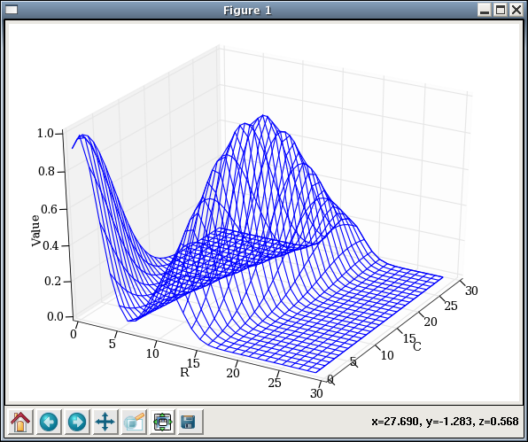

*************************
Topographica Command Line
*************************

The GUI interface of Topographica provides the most commonly used
plots and displays, but it is often useful to be able to manipulate
the underlying program objects interactively. The Topographica command
prompt allows you to do this easily, using the same syntax as in
Topographica scripts. This section describes the basic
`IPython`_-based interactive prompt that is available whenever
Topographica starts.  Topographica also supports the more
full-featured `IPython Notebook` interface using a web browser, which
supports all of the same commands and also provides interactive
visualization facilities similar to those in the GUI (but more
flexible).  See the `Tutorials` for examples of using the notebook 
interface.

The command prompt gives you direct access to `Python`_, and so any
expression valid for Python can be entered. For instance, if your
script defines a Sheet named V1, you can display and change V1's
parameters using Python commands:

::

    [cloud]v1cball: topographica -i ~/Documents/Topographica/examples/tiny.ty 

    Welcome to Topographica!

    Type help() for interactive help with python, help(topo) for general
    information about Topographica, help(commandname) for info on a
    specific command, or topo.about() for info on this release, including
    licensing information.

    topo_t000000.00_c1>>> topo.sim['V1'].density
                   Out[1]:5.0

    topo_t000000.00_c2>>> topo.sim['V1'].output_fns[0]
                   Out[2]:PiecewiseLinear(lower_bound=...)

    topo_t000000.00_c3>>> from topo.transferfn import *

    topo_t000000.00_c4>>> topo.sim['V1'].output_fns=[IdentityTF()]

    topo_t000000.00_c5>>> topo.sim['V1'].output_fns[0]
                   Out[5]:IdentityTF(name=...)

    topo_t000000.00_c6>>> topo.sim['V1'].activity
                   Out[6]:
    array([[ 0.,  0.,  0.,  0.,  0.],
           [ 0.,  0.,  0.,  0.,  0.],
           [ 0.,  0.,  0.,  0.,  0.],
           [ 0.,  0.,  0.,  0.,  0.],
           [ 0.,  0.,  0.,  0.,  0.]])
    ...

For very large arrays, numpy will suppress printing the array data
to avoid filling your terminal with numbers. If you do want to see
the data, you can tell numpy to print even the largest arrays:

::

    topo_t000000.00_c7>>> numpy.set_printoptions(threshold=2**30)

To see what is available for inspection or manipulation for any
object, you can use ``dir()``:

::

    topo_t000000.00_c10>>> dir(topo.sim['V1'])
                   Out[10]:
    ['_EventProcessor__abstract',
    ...
     'activity',
     'activity_len',
     'apply_output_fns',
     'bounds',
    ...]

Note the directory will typically include many items that are not
useful to inspect, including those starting with an underscore
(``_``), but it gives a good idea what an object contains. You can
also get information about most objects by typing ``?`` after the
name, or by using the ``help()`` function for more detailed
information:

::

    topo_t000000.00_c11>>> PiecewiseLinear?
    ...
    Docstring:
        Piecewise-linear TransferFn with lower and upper thresholds.
            
        Values below the lower_threshold are set to zero, those above
        the upper threshold are set to 1.0, and those in between are
        scaled linearly.

    Constructor information:
    Definition: PiecewiseLinear(self, **params)
    Docstring:
        Initialize this Parameterized instance.
            
        The values of parameters can be supplied as keyword arguments
        to the constructor (using parametername=parametervalue); these
        values will override the class default values for this one
        instance.
            
        If no 'name' parameter is supplied, self.name defaults to the
        object's class name with a unique number appended to it.

    topo_t000000.00_c12>>> help(topo.sim['Retina'])

    Help on GeneratorSheet in module topo.sheet object:

    class GeneratorSheet(topo.base.sheet.Sheet)
     |  Sheet for generating a series of 2D patterns.
     |  
     |  Typically generates the patterns by choosing parameters from a
     |  random distribution, but can use any mechanism.
     |  
    ...
     |  Methods defined here:
     |  
     |  __init__(self, **params)
     |  
     |  generate(self)
     |  Generate the output and send it out the Activity port.
     |  
    ...
     |  ----------------------------------------------------------------------
     |  Data descriptors defined here:
     |  
     |  apply_output_fns
     |  Whether to apply the output_fns after computing an Activity matrix.
     |  
     |  input_generator
     |  Specifies a particular PatternGenerator type to use when creating patterns.
     |  
    ... 
     |  ----------------------------------------------------------------------
     |  Data and other attributes defined here:
     |  
     |  src_ports = ['Activity']
     |  
    ... 

See the `IPython Quick Tutorial`_ for IPython-specific extensions useful 
from the command prompt.

Recreating results from interactive sessions
~~~~~~~~~~~~~~~~~~~~~~~~~~~~~~~~~~~~~~~~~~~~

While interactive creation and exploration of a simulation can be
very helpful, often you will want to create a representation of your
simulation that you can use again. One way of doing this is to save
an existing simulation that you have already created at the
commandline (see `save\_script\_repr`_ for how to save a runnable
specification of your simulation (but not its internal state), or
`save\_snapshot`_ for how to save your simulation's current state).
Another way is to create a .ty script file yourself, and then run it
with Topographica. As discussed in the `Topographica scripts`_
section, exactly the same commands can be entered in a .ty file as
at the commandline, and running the .ty file (either by passing it
at startup to the topographica program on the commandline, or by
passing it as an argument to ``execfile()``) is equivalent to
entering its commands manually.

.. _pylab:

Plotting from the command line
------------------------------

If the GUI is running, you can also plot any vector or matrix in the
program:

::

    $ topographica -g ~/Documents/Topographica/examples/tiny.ty
    Topographica> topo.sim.run(1)
    Topographica> from topo.command.pylabplot import *
    Topographica> V1 = topo.sim['V1']
    Topographica> matrixplot(V1.activity)
    Topographica> vectorplot(V1.activity[0])
    Topographica> vectorplot(V1.activity[1])
    Topographica> vectorplot(V1.activity[10])
    Topographica>

Result:

.. figure:: images/matrixvectorplot.png
   :align: center
   :alt: 

.. _3d-plotting:

You can also try replacing matrixplot with matrixplot3d to get a 3D
wireframe plot:

::

    Topographica> matrixplot3d(V1.activity)

Result:

Be sure to try clicking and dragging on the plot, to rotate the
viewpoint.

The prompt can also be used for any mathematical calculation or
plotting one might wish to do, a la Matlab:

::

    $ topographica -g
    Topographica> from numpy import *
    Topographica> 2*pi*exp(1.6)
    31.120820554943471
    Topographica> t = arange(0.0, 1.0+0.01, 0.01)
    Topographica> s = cos(2*2*pi*t)
    Topographica> from pylab import *
    Topographica> plot(s)
    [<matplotlib.lines.Line2D instance at 0xb6b1aeac>]
    Topographica> show._needmain = False
    Topographica> show()

Resulting plot:

.. figure:: images/sine_plot.png
   :align: center
   :alt: 

See the `numpy documentation`_ for more details on the mathematical
expressions and functions supported, and the `MatPlotLib
documentation`_ for how to make new plots and change their axes,
labels, titles, line styles, etc.

.. _saving-bitmaps:

Saving or accessing Topographica bitmaps
----------------------------------------

A command save\_plotgroup is provided to allow you to automate the
process of generating and saving the various bitmap images visible
in the Topographica GUI. For instance, to measure an orientation map
and save the resulting bitmaps to disk, just do:

::

    Topographica> from topo.command.analysis import measure_or_pref
    Topographica> from topo.plotting.plotgroup import save_plotgroup
    Topographica> measure_or_pref()
    Topographica> save_plotgroup("Orientation Preference")

The name "Orientation Preference" here is just the name used in the
Plots menu, and the command "measure\_or\_pref()" is listed at the
bottom of the Orientation Preference window. These names and
functions are typically defined in topo/command/analysis.py, and are
used to present testing images and store the resulting responses.
The command save\_plotgroup then uses this data to generate the
bitmap images, and saves them to disk.

By default, all output from Topographica goes into ``Topographica``
folder in your ``Documents`` directory (this can be customized, and
is ``~/topographica`` in release 0.9.7 and earlier; see the note
about the `default output path`_ for more information).

Other examples:

::

    save_plotgroup("Activity")
    save_plotgroup("Projection",projection=topo.sim['V1'].projections('Afferent'))

As shown above, some plotgroups (such as Projection) accept optional
parameters. Using these commands makes it possible to run
simulations without any GUI, for batch or remote processing.

It is also possible to access these bitmaps from the command line,
if you want to analyze them rather than save them. For example to
see the matrix of values for the OrientationPreference, plus the
bounding box in Sheet coordinates, do:

::

    measure_or_pref()
    (mat,bbox)=topo.sim['V1'].sheet_views['OrientationPreference'].view()
    print mat
    print bbox.lbrt()

Imports
-------

In the sample code above, each command is imported (i.e., loaded and
declared) from the appropriate file before it is used. Python
requires such importing to avoid confusion between similar commands
defined in different files; see the Python documentation for `more
information about imports`_.

To avoid confusion, we recommend you take advantage of Python's
namespaces (as mentioned earlier in the `Imports`_ section of the
Topographica Scripts page) when working interactively at the
commandline. For instance, ``pattern.random.UniformRandom`` is
clearly distinct from ``numbergen.UniformRandom``; importing one or
the other (or both!) as only ``UniformRandom`` (e.g.
``from numbergen import UniformRandom``) could lead to confusion. Of
course you might decide that in many cases, using the namespace at
the command-line involves too much typing; you are free to use
whichever technique you prefer.

.. _option-a:

Simplifying imports during interactive runs
~~~~~~~~~~~~~~~~~~~~~~~~~~~~~~~~~~~~~~~~~~~

When working interactively, typing common import lines (such as
``from topo.command.analysis import measure_or_pref``,
from the earlier example) can be tedious. Topographica therefore
provides the "-a" command-line option, which automatically imports
every command in topo/command/\*.py. The "-g" option also
automatically enables "-a", so that the commands will be available
in the GUI as well. Thus if you start Topographica as "topographica
-a" or "topographica -g", then you can omit the
``from topo.command... import ...`` lines above. Still, it is best
never to rely on this behavior when writing .ty script files or .py
code, because of the great potential for confusion, so please use
"-a" only for interactive debugging.

.. _promptformat:

Customizing the command prompt
------------------------------

The contents of the command prompt itself are controlled by the
`CommandPrompt`_ class, and can be set to any Python code that
evaluates to a string. As of 09/2008, the default prompt is
``topo_t000000.00_c1>>>``, where ``t000000.00`` is the current value
of ``topo.sim.time()`` when the prompt is printed, and the ``1``
following ``c`` is IPython's record of your command number (IPython
caches your input and output in the lists ``In`` and ``Out``
respectively; the command number allows you to access a specific
entry as e.g. ``In[1]``).

You can change the prompt format by doing something like:

::

      from topo.misc.commandline import CommandPrompt
      CommandPrompt.set_format('${my_var}>>> ')        

where in this case the value of a variable ``my_var`` will be
checked each time before the prompt is printed. IPython allows the
prompt to be configured in many ways; see IPython's `User Manual`_
for full details about what you can pass as an argument to
``CommandPrompt.set_format`` in Topographcia.

In addition to the input prompt described above, there is also an
output prompt (e.g. ``Out[3]:``) and a continuation prompt (e.g.
``....:``). You can also customize these in the same way as the
input prompt by using the `OutputPrompt`_ and `CommandPrompt2`_
classes, respectively, in the same way.

Site-specific customizations
----------------------------

If you have any commands that you want to be executed whenever you
start Topographica, you can put them into the `user configuration
file`_. For instance, to use the ANSI colors every time, just add
these lines to your user configuration file:

::

    from topo.misc.commandline import CommandPrompt
    CommandPrompt.format = CommandPrompt.ansi_format

.. _min-print-level:

Debugging or verbose messaging
------------------------------

If you want to study exactly how Topographica is operating, e.g. to
extend it or control it from the command line, you can consider
changing the ``param.parameterized.min_print_level`` parameter so
that messages will be printed whenever Topographica performs an
action. For instance, you can enable verbose messaging by starting
Topographica as:

::

      topographica -c "import param" \
      -c "param.parameterized.min_print_level=param.parameterized.VERBOSE" ...

Instead of VERBOSE, you can use any of the other message levels
defined in parameterized.py, such as DEBUG, which gives even more
information (typically much more than is useful).

.. _scripting-gui:

Controlling the GUI from scripts or the command line
----------------------------------------------------

The code for the Topographica GUI is kept strictly separate from the
non-GUI code, so that Topographica simulations can be run remotely,
automated using scripts, and upgraded to newer graphical interface
libraries as they become available. Thus in most cases it is best to
ensure that your scripts do not contain any GUI-specific code. Even
so, in certain cases it can be very helpful to automate GUI
operations using scripts or from the command line, e.g. if you
always want to open a standard set of windows for analysis.

For such situations, Topographica provides a simple interface for
controlling the GUI from within Python. For instance, to open an
Activity window, which is under the Plots menu, type:

::

      import topo
      topo.guimain['Plots']['Activity']()

Some menu items accept optional arguments, which can be supplied as
follows:

::

      import topo
      topo.guimain['Plots']['Connection Fields'](x=0.1,y=0.2,sheet=topo.sim['V1'])
      topo.guimain['Plots']['Activity'](normalize=True,auto_refresh=False)

Other examples:

::

      topo.guimain['Plots']['Preference Maps']['Orientation Preference']();

      p=topo.guimain['Plots']
      p['Activity']();
      p['Connection Fields']()
      p['Projection']()
      p['Projection Activity']()
      p['Tuning Curves']['Orientation Tuning']()

      topo.guimain['Simulation']['Test Pattern']()
      topo.guimain['Simulation']['Model Editor']()

In each case, the syntax for calling the command reflects the
position of that command in the menu structure. Thus these examples
will no longer work as the menu structure changes; no backwards
compatibility will be provided. These commands should be treated
only as a shortcut way to invoke GUI menu items, not as an archival
specification for how a model works.

Note that if you are doing any of these operations from a
Topographica script, it is safest to check first that there is a GUI
available, because otherwise the script cannot be executed when
Topographica is started without the -g option. Topographica defines
the ``guimain`` attribute of the ``topo`` namespace only when there
is a GUI available in this run. Thus if you check to make sure that
guimain is defined before running your GUI commands:

::

      if hasattr(topo,'guimain'):
         topo.guimain['Plots']['Activity']()

then your scripts should still work as usual without the GUI (apart
from opening GUI-related windows, which would not work anyway).

Additionally, it is possible to script more complex GUI operations.
For instance, one can open an Orientation Preference window and
request that the map be measured by invoking the 'Refresh' button:

::

      o = topo.guimain['Plots']['Preference Maps']['Orientation Preference']()
      o.Refresh() # measure the map: equivalent to pressing the Refresh button

Parameters of the plots can also be set. Continuing from the
previous example, we can switch the plots to be in sheet
coordinates, and alter the pre-plot hooks so that progress will be
displayed in an open Activity window:

::

      o.sheet_coords=False
      for f in o.pre_plot_hooks:
         f.display=True

At present, not all GUI operations can be controlled easily from the
commandline, but eventually all will be available.

Note that in some cases the GUI will reformat the name of a
parameter to make it match look-and-feel expectations for GUI
interfaces, such as removing underscores from names, making the
initial letter capital, etc. (e.g. in the Test Pattern window). If
you want to disable this behavior so that you can tell exactly which
parameter name to use from the command line or in a script, you can
turn off the parameter name reformatting:

::

      from param.tk import TkParameterized
      TkParameterized.pretty_parameters=False

One can also open a GUI window to inspect or edit any Parameterized
object:

::

     from param.tk import edit_parameters
     edit_parameters(topo.sim['V1']) 

This gives a ParametersFrame representing the Parameters of
``topo.sim['V1']``, allowing values to be inspected and changed.
(This is the same editing window as is available through the `model
editor`_.)

.. _Tutorials: http://topographica.org/Tutorials
.. _Python: http://python.org/doc/
.. _IPython: http://ipython.org/
.. _IPython Notebook: http://ipython.org/notebook.html
.. _IPython Quick Tutorial: http://ipython.scipy.org/doc/manual/html/interactive/tutorial.html
.. _save\_script\_repr: ../Reference_Manual/topo.command-module.html#save_script_repr
.. _save\_snapshot: ../Reference_Manual/topo.command-module.html#save_snapshot
.. _Topographica scripts: scripts.html#ty-files
.. _numpy documentation: http://scipy.org/Documentation
.. _MatPlotLib documentation: http://matplotlib.org/
.. _default output path: scripts.html#output-path
.. _more information about imports: http://docs.python.org/2/tutorial/modules.html
.. _Imports: scripts.html#imports
.. _CommandPrompt: ../Reference_Manual/topo.misc.commandline.CommandPrompt-class.html
.. _User Manual: http://ipython.scipy.org/doc/manual/html/config/index.html
.. _OutputPrompt: ../Reference_Manual/topo.misc.commandline.OutputPrompt-class.html
.. _CommandPrompt2: ../Reference_Manual/topo.misc.commandline.CommandPrompt2-class.html
.. _user configuration file: scripts.html#user-configuration-file
.. _model editor: modeleditor.html#parameters
