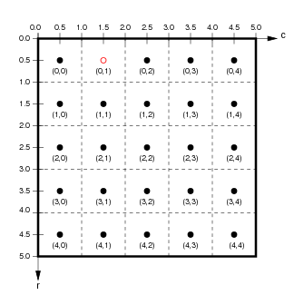

*********************************
ImaGen spatial coordinate systems
*********************************

ImaGen supports resolution-independent specification and generation
of input patterns. To achieve this, ImaGen provides multiple spatial
coordinate systems, called *Sheet* and *matrix* coordinates.

Sheet coordinates
-----------------

User-accessible quantities are always expressed in Sheet
coordinates, which are resolution independent. An ImaGen
`SheetCoordinateSystem`_ is a rectangularly bounded region of a
continuous two-dimensional plane. The default SheetCoordinateSystem
has a square area of 1.0 centered at (0.0,0.0):

.. figure:: images/sheet_coords.png
   :align: center
   :alt: 

Locations in a SheetCoordinateSystem are specified using
floating-point Sheet coordinates (x,y) contained within the
SheetCoordinateSystem's `BoundingBox`_. The thick black line in the
figure above shows the BoundingBox of the default
SheetCoordinateSystem, which extends from (-0.5,-0.5) to (0.5,0.5)
in Sheet coordinates. Any coordinate within the BoundingBox is a
valid Sheet coordinate.

Matrix coordinates
------------------

Although users primarily manipulate the abstract, continuous
SheetCoordinateSystem, the actual output from a PatternGenerator is
a finite matrix that regularly samples this continuous space. Each
SheetCoordinateSystem has a parameter called its *density*, which
specifies how many units (matrix elements) in the matrix correspond
to a unit length in Sheet coordinates. For instance, the default
SheetCoordinateSystem above with a density of 5 corresponds to the
matrix on the left below:

|image0| |image1|

Here, the 1.0x1.0 area of Sheet coordinates is represented by a 5x5
matrix, whose BoundingBox (represented by a thick black outline)
corresponds exactly to the BoundingBox of the Sheet to which it
belongs. Each floating-point location (x,y) in Sheet coordinates
corresponds uniquely to a floating-point location (r,c) in
floating-point matrix coordinates, and vice versa. Individual units
or elements in this array are accessed using integer *matrix index*
coordinates, which can be calculated from the matrix coordinate
``(r,c)`` as (``floor(int(r))``,\ ``floor(int(c))``).

For the example shown, the center of the unit with matrix index
(0,1) is at location (0.5,1.5) in matrix coordinates and (-0.2,0.4)
in Sheet coordinates. Notice that matrix and matrix index
coordinates start at (0.0,0.0) in the upper left and increase down
and to the right (as is the accepted convention for matrices), while
Sheet coordinates start at the center and increase up and to the
right (as is the accepted convention for Cartesian coordinates).

The reason for having multiple sets of coordinates is that the same
SheetCoordinateSystem can at another time yield a different matrix
specified by a different density. For instance, if this
SheetCoordinateSystem had a density of 10 instead, the corresponding
matrix would be:

|image2| |image3|

Using this higher density, Sheet coordinate (-0.2,0.4) now
corresponds to the matrix coordinate (1.0,3.0). As long as the user
interface specifies all units in Sheet coordinates and converts
these to matrix coordinates appropriately, the user can use
different densities at different times without changing any other
parameters.

Technical details
~~~~~~~~~~~~~~~~~

In some cases, the details of representing a SheetCoordinateSystem
with a matrix of a certain density can be more complex than
described above, because it is possible to specify a bounds and
density combination that cannot be realized exactly. For this
reason, the quantities set by the user are called
``nominal_density`` and ``nominal_bounds``, and the true bounds and
density are calculated from these.

For instance, consider requesting that a SheetCoordinateSystem have
bounds of ``BoundingBox(radius=0.3)``, and density of ``7``. Such an
area (a 0.6 x 0.6 square) cannot be tiled exactly by 7 units per 1.0
length. When such a SheetCoordinateSystem is created, the density
will be adjusted so that the requested sheet bounds (and thus the
overall area) is respected. In this example, the
SheetCoordinateSystem would have an actual density of 6.67 (the
closest value to tile the plane exactly; see
`SheetCoordinateSystem`_). This approach was chosen so that whenever
the density is changed, the matrix remains the best possible
approximation of the requested area.

In summary, the bounds specified for a SheetCoordinateSystem are
respected, but the density may be adjusted so that the plane is
tiled exactly.

.. _SheetCoordinateSystem: ../Reference_Manual/imagen.sheetcoords.SheetCoordinateSystem-class.html
.. _BoundingBox: ../Reference_Manual/imagen.boundingregion.BoundingBox-class.html

.. |image1| image:: images/sheet_coords_-0.2_0.4.png
.. |image2| image:: images/matrix_coords_hidensity.png
.. |image3| image:: images/sheet_coords_-0.2_0.4.png
