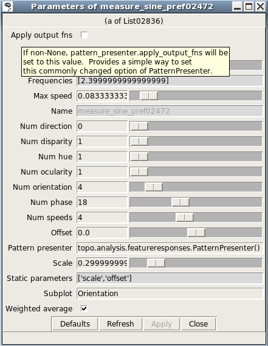

**************************
Plotting and visualization
**************************

Topographica includes a general-purpose system for managing and
plotting visualizations of Sheets and Projections. New types of
plots can be added easily, without any GUI programming, allowing
users to visualize any quantities of interest.

Basic plots
-----------

The basic plots useful for nearly any model are demonstrated in the
`LISSOM tutorial`_:

`Activity`_
 Plots the activity level of each unit.
`Connection Fields`_
 Plots the strength of each weight in each ConnectionField of one
 unit.
`Projection`_
 Plots an array of ConnectionFields making up a Projection to one
 Sheet.
`ProjectionActivity`_
 Plots the contribution from each Projection to the activity of one
 Sheet.

As an example, the most commonly used plot is Activity:

.. figure:: images/lissom_oo_or_10000_activity_mono_pointer.png
   :align: center
   :alt: 

This group of plots (a "PlotGroup") includes one plot per Sheet, and
this particular simulation has four Sheets. Each plot is a bitmap
representation of the matrix that makes up that Sheet. Moving the
mouse over each image will show the coordinates at that location, as
well as the value of the plot at that point. Note that two sets of
coordinates are shown: integer `matrix coordinates`_, which show the
internal layout of units within the Sheet, starting at the upper
left, and floating-point `sheet coordinates`_, which show the
Topographica density-independent coordinates used when specifying
parameters in scripts and the GUI (with 0.0,0.0 usually at the
center). Right clicking at the location shown (usually control-click
on a 1-button Mac system) would allow the user to open a
ConnectionField plot for the indicated unit, as well as run other
analyses or visualizations of this unit or Sheet.

If you have measured an orientation map, the Activity plot shows
other information as well:

.. figure:: images/lissom_oo_or_10000_activity.png
   :align: center
   :alt: 

Here the color of each unit in V1 is determined by that unit's
orientation preference, so that one can see that different input
orientations result in different types of neurons activated.
measure\_or\_pref() changes the activity plot so that it is actually
specified as a combination of three SheetViews on different
*channels*:

-  Strength: Activity
-  Hue: OrientationPreference
-  Confidence: OrientationSelectivity

That is, the primary plot (the Strength channel) is Activity, but it
is colorized with the OrientationPreference (the Hue channel). The
amount of colorization depends on the OrientationSelectivity (the
Confidence channel), which is appropriate because unselective
neurons then show up white. The monochrome plot shown first above
was obtained by toggling the "Strength only" button, which disables
Hue and Confidence so that the result is as it was before running
measure\_or\_pref().

For a plot with multiple channels, moving the mouse over the bitmap
will show the values in all of the available channels, and the
right-click menu will allow you to see what channels are available,
and to plot or analyze any of the channels independently.

The color coding can be changed to some other plot using the
convenience function Subplotting.set\_subplots:

::

      from topo.command.analysis import Subplotting
      Subplotting.set_subplots("Direction")

or disabled entirely:

::

      from topo.command.analysis import Subplotting
      Subplotting.set_subplots()

Preference map plots
--------------------

The basic plots display data that is already available within
Topographica, to visualize the structure or behavior of the model
directly. Another important type of visualization is preference map
plots, which measure and show the input patterns to which a neural
unit responds most strongly. That is, they are an indirect
measurement based on actively providing a stimulus and measuring the
response. These maps are calculated using a `general-purpose
preference map analysis package`_, described below, and are
primarily specified in `topo/command/analysis.py`_. The available
plots include:

Position Preference
 Measure preference for the X and Y position of a Gaussian.
Center of Gravity
 Measure the center of gravity of each ConnectionField in a
 Projection to one Sheet.
`Orientation Preference`_
 Measure preference for sine grating orientation.
Ocular Preference
 Measure preference for sine gratings between two eyes.
Spatial Frequency Preference
 Measure preference for sine grating frequency.
Direction Preference, Speed Preference
 Measure motion direction and speed for drifting sine gratings.
PhaseDisparity Preference
 Measure preference for sine gratings differing in phase between two
 sheets.
Hue Preference
 Measure preference for color.

.. _rfplots:

Receptive fields plots
----------------------

Often, rather than a Connection Field (a set of weights from one
Projection between two Sheets), you will want to know the Receptive
Field (RF) of a unit -- the locations to which it responds on an
input sheet, even across multiple projections (i.e., multiple
synapses).

Such plots can be measured using the RF Projection plot, which uses
reverse correlation to estimate which units on an input sheet cause
the strongest response of a unit in a later sheet. It works just
like a `Projection`_ plot, except that it takes much, much longer to measure (as it
requires presenting a large number of test patterns), is not
specific to any particular Projection, and is an estimate rather
than a visualization of a set of weights. Example result for an
ON/OFF LISSOM network trained on oriented Gaussians:

.. figure:: images/rf_projection.png
   :align: center
   :alt: 

Once the RFs have been measured, the RF can be visualized for a
particular unit by right clicking on that unit in any plot window,
and selecting a Receptive Fields plot. Sample result:

.. figure:: images/rf_matrixplot.png
   :align: center
   :alt: 

Tuning curve plots
------------------

The above plots are all visualized as a two-dimensional array of
values. Other common plots are visualized as a set of
one-dimensional curves, including:

Orientation Tuning Fullfield
 Plot orientation tuning curves for a specific unit, measured using
 full-field sine gratings. Although the data takes a long time to
 collect, once it is ready the plots are available immediately for
 any unit.
Orientation Tuning
 Measure orientation tuning for a specific unit at different
 contrasts, using a pattern chosen to match the preferences of that
 unit.
Size Tuning
 Measure the size preference for a specific unit.
Contrast Response
 Measure the contrast response function for a specific unit.

Each of these plots shows the properties of one user-selectable
unit. For instance, the Orientation Tuning Fullfield plot shows how
the response of that unit varies with orientation and contrast:

.. figure:: images/or_tuning.png
   :align: center
   :alt: 

Here each curve represents one value of contrast tested, and each
data point on the curve represents the response of this unit to an
input of the specified contrast and orientation, as a maximum over
all phases tested.

The tuning curve plots are measured just as the preference map plots
are (and using the same code), but they are visualized in a
different way.

Changing existing plots
-----------------------

The available plots are all specified in a general way that allows
users to change the details of how the data is visualized. Each plot
is part of a PlotGroup that specifies a list of commands ('hooks')
to run to generate the data, and then how to visualize the results
for all the Sheets in the simulation at once.

The list of hooks used is shown in the plot window as "Pre plot
hooks", where users can change the parameters of existing hooks, and
add or remove hooks. For instance, if you want to reduce the number
of sine grating phases used when measuring orientation maps, say,
from 18 to 8, you can right click on the list of hooks, choose
Properties, and then, in the new window displaying the list entries,
right click on the ``measure_sine_pref.instance()`` entry:

.. figure:: images/edit_list.png
   :align: center
   :alt: 

This will give you a properties window for that item:

Here you can reduce the number of phases by dragging the appropriate
slider. The next time the plot is refreshed, the new value will be
used instead.

The properties window for a list entry shows what parameters are
available; hovering the mouse over a parameter name gives a brief
description. More detail about various commands is available in
`topo/command/analysis.py`_ and `topo/command/pylabplot.py`_.

Some plots also use "Plot hooks", called after the "Pre plot hooks",
to actually visualize the results. For instance, some commands
generate data for all units in a Sheet, but the PlotGroup displays
results from only a single sheet; in this case the plot hooks
(usually much quicker to run than the pre-plot hooks) are called
whenever a new unit is selected.

If you often need to change the parameters for map or curve
measurement, then you can do that easily without modifying your copy
of Topographica by putting appropriate lines into the .ty script to
which they apply. For instance, the default parameters used in most
preference map measurement commands present each pattern for only a
very short duration and turn off the response function, which works
well with the example files because doing so results in a linear
response (no threshold function and no lateral interactions) and
thus makes the results independent of the input scale and offset. If
this approach is not valid for your own model, then you can change
the duration for which sine gratings are presented to 1.0, and turn
on the response function by default:

::

    from topo.analysis.featureresponses import MeasureResponseCommand
    MeasureResponseCommand.duration=1.0
    MeasureResponseCommand.apply_output_fns=True

These values are actually Topographica's defaults, and thus omitting
all code in your .ty file to do with MeasureResponseCommand would
also have the same effect. In any case, the specific parameters here
can be anything you want, and you can do it for any plot group.

Similarly, you can change the specific types of data used in each
plot. For instance, you can remove the default OrientationPreference
subplot from Activity plots using:

::

      from topo.plotting.plotgroup import plotgroups
      plotgroups["Activity"].plot_templates["Activity"]["Hue"]=None
      plotgroups["Activity"].plot_templates["Activity"]["Confidence"]=None

(which is what Subplotting.set\_subplots() does, for Activity and
several other types of plots).

You can also put lines like these into your `user configuration
file`_, if you find that you always want different defaults than
Topographica's, for all scripts that you run.

.. _measuring-preference-maps:

Adding a new plot
-----------------

The types of plots included with Topographica are only examples, and
it is quite straightforward to add a new type of preference map
plot. As a reference, here is an implementation of Orientation
Preference plots:

::

    1. pg= create_plotgroup(name='Orientation Preference',category="Preference Maps",
                            doc='Measure preference for sine grating orientation.',
    2.                  command='measure_or_pref()')
    3. pg.add_plot('Orientation Preference',[('Hue','OrientationPreference')])
    4. pg.add_plot('Orientation Preference&Selectivity',[('Hue','OrientationPreference'),
                                                         ('Confidence','OrientationSelectivity')])
    5. pg.add_plot('Orientation Selectivity',[('Strength','OrientationSelectivity')])
    6. pg.add_static_image('Color Key','topo/command/or_key_white_vert_small.png')
           
           
    7. def measure_or_pref(num_phase=18,num_orientation=4,frequencies=[2.4],
                           scale=0.3,offset=0.0,display=False,weighted_average=True,
    8.                 pattern_presenter=PatternPresenter(pattern_generator=SineGrating(),
                               apply_output_fns=False,duration=0.175)):
           step_phase=2*pi/num_phase
           step_orientation=pi/num_orientation
           
    9. feature_values = [Feature(name="frequency",values=frequencies),
                             Feature(name="orientation",range=(0.0,pi),step=step_orientation,cyclic=True),
                             Feature(name="phase",range=(0.0,2*pi),step=step_phase,cyclic=True)]
           
    10.param_dict = {"scale":scale,"offset":offset}
    11.x=FeatureMaps(feature_values)
           x.collect_feature_responses(pattern_presenter,param_dict,display,weighted_average)

What the first part of this code (the PlotGroup specification) does
is:

#. Declare that the Orientation Preference plot group should go on
   the Preference Maps menu, with the indicated help string
#. Declare that before trying to plot this data, generate it by
   calling the command "measure\_or\_pref", which is defined next.
#. To this plot group, add up to one plot per Sheet named
   "Orientation Preference", plotting any Image named
   OrientationPreference, using a color plot (as the Hue channel).
#. Add up to one more plot per Sheet, this time plotting the
   Orientation in the Hue channel and the Orientation Selectivity in
   the Confidence channel (so that unselective neurons show up
   white).
#. Add up to one more plot per Sheet, this time plotting the the
   Orientation Selectivity by itself in grayscale (as a Strength).
#. Add a color key as a static image appended to every plot.

The rest of the code specifies the actual procedure for measuring
the appropriate data:

7.  Declare the parameters accepted by measure\_or\_pref()
8.  Define the default object that will generate input patterns, in
    this case sine gratings (but any other PatternGenerator can also
    be used).
9.  Specify the ranges of parameter values to be tested -- each of
    these defines one possible map (FrequencyPreference,
    OrientationPreference, and PhasePreference, in this case). The
    contents of each map will be an estimate of the value of this
    parameter that will most strongly activate the corresponding
    unit.
10. Add a few more parameter values that will not be varied (and
    thus will not generate preference maps).
11. Present all combinations of feature values and collate the
    responses.

The preference for any input pattern can be measured using nearly
identical code, just selecting a different PatternGenerator and
specifying a different list of features to vary. For each feature,
you will need to know the range and number of steps you want to
test, plus whether it is cyclic (i.e. wraps back around to zero
eventually, and is thus best visualized as a Hue).

Note that the selectivity is by default boosted significantly so
that combined plots will be visible, because the selectivity scales
are essentially arbitrary. To change the scaling in specific cases,
you can adjust the FeatureMaps.selectivity\_multiplier parameter:

::

      from topo.analysis.featureresponses import FeatureMaps
      FeatureMaps.selectivity_multiplier=1.0

Also note that the Orientation Preference plot code above shows just
one possible way of implementing such a plot; in Topographica
itself, a hierarchy of classes is used to simplify the definition of
multiple types of plots.

Additionally, the data for plotting can also be calculated in any
other way (ignoring FeatureMaps and PatternPresenter altogether), as
long as it results in a Image added to the appropriate
sheet\_views dictionary and specified in the template. For instance,
the `measure\_cog`_ command used in Center of Gravity plots simply
looks at each ConnectionField individually, computes its center of
gravity, and builds a Image out of that (rather than presenting
any input patterns).

.. _LISSOM tutorial: ../Tutorials/lissom_oo_or.html
.. _Activity: ../Tutorials/lissom_oo_or.html#activity-plot
.. _Connection Fields: ../Tutorials/lissom_oo_or.html#connectionfields-plot
.. _Projection: ../Tutorials/lissom_oo_or.html#projection-plot
.. _ProjectionActivity: ../Tutorials/som_retinotopy.html#projection-activity-plot
.. _matrix coordinates: space.html#matrix-coords
.. _sheet coordinates: space.html#sheet-coords
.. _general-purpose preference map analysis package: #adding-a-new-plot
.. _topo/command/analysis.py: ../Reference_Manual/topo.command.analysis-module.html
.. _Orientation Preference: ../Tutorials/lissom_oo_or.html#orientationpreference-plot
.. _topo/command/pylabplot.py: ../Reference_Manual/topo.command.pylabplot-module.html
.. _user configuration file: scripts.html#user-configuration-file
.. _measure\_cog: ../Reference_Manual/topo.command.analysis-module.html#measure_cog
