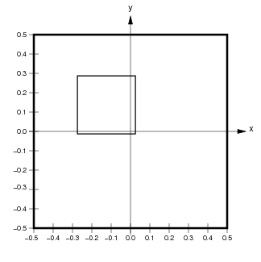

***************************************
Topographica spatial coordinate systems
***************************************

Topographica allows simulation parameters to be specified in units
that are independent of the level of detail used in any particular
run of the simulation. To achieve this, Topographica provides
multiple spatial coordinate systems, called *Sheet* and *matrix*
coordinates. These coordinate systems are primarily described in the
`ImaGen package`_, which should be examined before going further on
this page. Here we describe only the Topographica-specific aspects
of the coordinate systems.

Connection fields
-----------------

Units in a Topographica Sheet can receive input from units in other
Sheets. Such inputs are generally contained within a
`ConnectionField`_, which is a spatially localized region of an
input Sheet. A ConnectionField is bounded by a BoundingBox that is a
subregion of the Sheet's BoundingBox. The units contained within a
ConnectionField are those whose centers lie within that BoundingBox.

For instance, if the user specifies a ConnectionField with Sheet
bounds from (-0.275,-0.0125) to (0.025,0.2885) for a sheet with a
density of 10, the corresponding matrix coordinate bounds are
(5.125,2.250) to (2.125,5.250):

|image0| |image1|

Here the medium black outline shows the user-specified
ConnectionField BoundingBox in matrix and Sheet coordinates. The
units contained in this ConnectionField are (4,2) to (2,4)
(inclusive; shown by black dots with a yellow background). Notice
that the Sheet area of the ConnectionField will not necessarily
correspond exactly to the user-specified BoundingBox, because the
matrix is discrete.

Note that a ConnectionField is similar to the biological concept of
a receptive field (RF), but the two concepts are the same only for
models with one input sheet and one cortical sheet. When there is
more than one hierarchical level, the ConnectionField of a top-level
unit is a set of weights on the previous Sheet, while the receptive
field is an area of the input sheet to which the unit responds. Thus
a ConnectionField is a lower-level concept than a receptive field,
and RFs can be thought of as constructed from CFs.

Edge buffering
--------------

If every Sheet has the default 1.0x1.0 area, units near the border
of higher-level Sheets will have ConnectionFields that extend past
the border of lower-level Sheets. This ConnectionField cropping will
often result in artifacts in the behavior of units near the border.
To avoid such artifacts, lower-level Sheets should usually have
areas larger than 1.0x1.0.

For instance, assume that Sheets have a 1.0x1.0 area. If a higher
level sheet U has a ConnectionField BoundingBox of size 0.4x0.4 on
lower-level Sheet L, neurons near the border of U will have up to
0.2 in Sheet coordinates cut off of their ConnectionFields. To
prevent this, the BoundingBox of L can be extended by 0.2 in Sheet
coordinates in each direction:

.. figure:: images/retina_edge_buffer.png
   :align: center
   :alt: 

Here, the thick black line shows the calculated size of L to avoid
edge cropping, and the dotted line shows the size of U for
reference. If L were the size of U, up to three quarters of the
ConnectionField of units in U near the border would be cut off. With
the size of L extended as shown, all units in U will have full
ConnectionFields. Thus when calculating the behavior of U, the
extended L will work as if L were infinitely large in all
directions. This approach is appropriate for avoiding edge effects
when modeling a small patch of a larger system.

Of course, this technique cannot help you avoid such cropping for
lateral connections within U or feedback connections from areas
above U. In some simulators, periodic boundary conditions can be
enforced such that such connections wrap around like a torus,
avoiding these issues. However, such wrapping is not practical in
Topographica, which focuses on drawing realistic input patterns like
photographs, which cannot be rendered properly on a torus.

Technical details
~~~~~~~~~~~~~~~~~

In addition to the `details discussed with the ImaGen package`_,
Topographica Sheets have an additional complication for certain
bounds and densities when using non-square sheets. Consider the
example from ImaGen, but instead with rectangular bounds given by
``BoundingBox(points=((-0.3,-0.5),(0.3,0.5)))``. This time, the y
dimension would be tiled exactly by a density of 7, but the x
dimension would not. This problem could be solved by allowing a
Sheet to have different densities in each dimension (i.e. an
xdensity and a ydensity); indeed, the `SheetCoordinateSystem`_
underlying a Sheet does not require that the xdensity and ydensity
are equal. However, for a Sheet itself, it is simpler for the
density to be equal in both dimensions. To solve the problem above,
then, Topographica takes the bounds's x-width and calculate an
xdensity from this (as described for the previous example), and
makes the ydensity exactly equal to this by adjusting the top and
bottom bounds. In our example, the top bound would be adjusted to
0.525, and the bottom to -0.525---the closest bounds allowing a
density of 6.67 to tile the dimension exactly.

In summary, the bounds specified for a Sheet are respected, but the
density may be adjusted so that the plane is tiled exactly. In
certain cases where it is not possible to have the same density in
the y direction as in the x direction with the specified bounds, the
top and bottom bounds are adjusted so that the densities can remain
equal. This is an "x-bounds-master" approach; futher discussion of
this and alternatives is available in `SheetCoordinateSystem`_.

.. _ImaGen package: coords.html
.. _ConnectionField: ../Reference_Manual/topo.base.cf.ConnectionField-class.html
.. _details discussed with the ImaGen package: coords.html#technical-details
.. _SheetCoordinateSystem: ../Reference_Manual/imagen.sheetcoords.SheetCoordinateSystem-class.html

.. |image0| image:: images/connection_field.png

